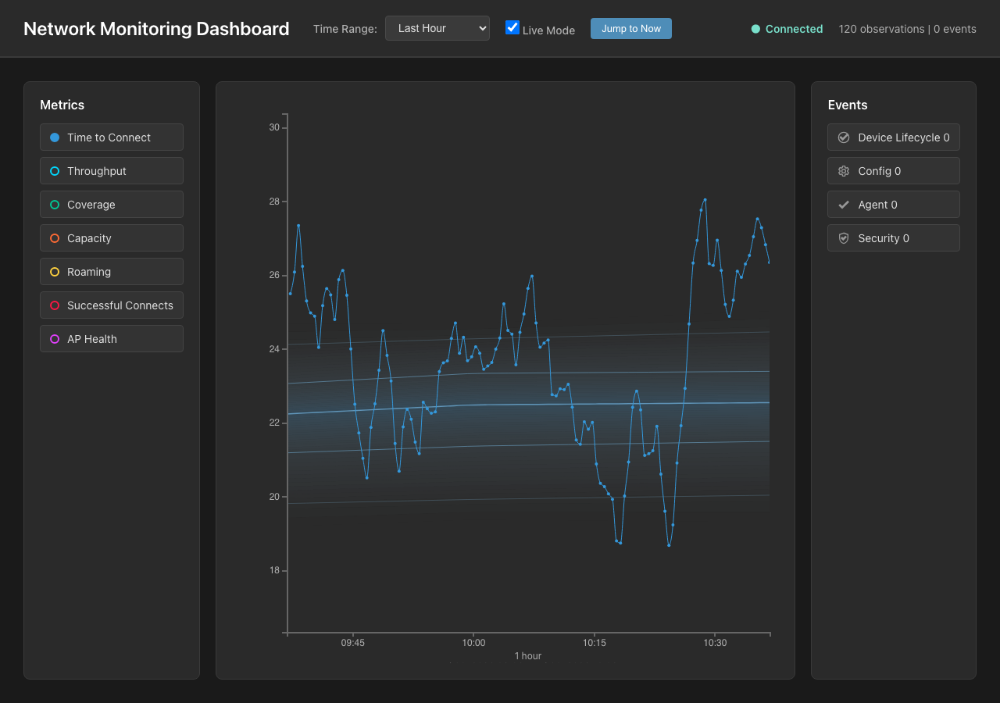
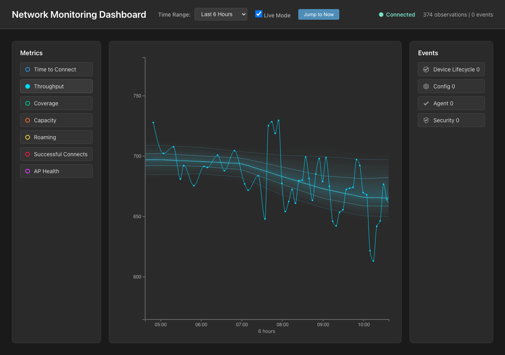
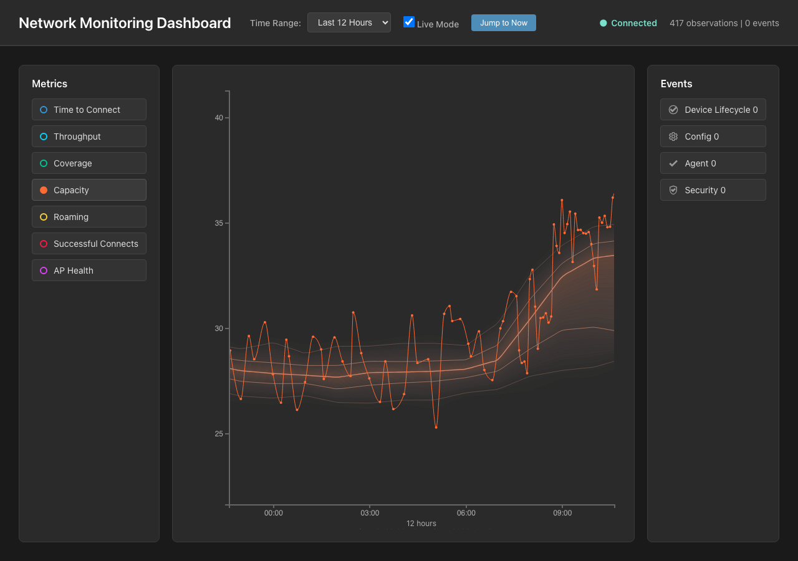
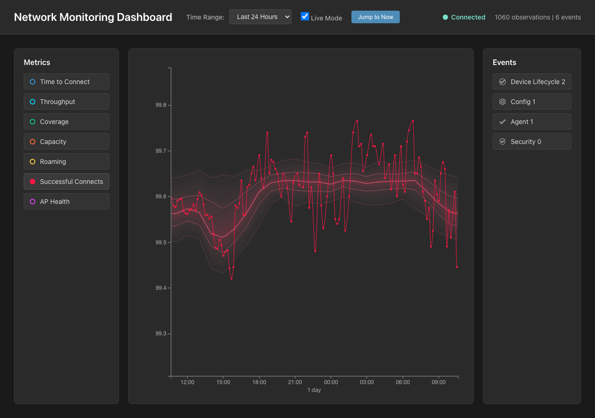

# Distribution Ribbon Visual Acceptance

## Summary

The corrected ribbon replaces health-colored bands with a metric-hue distribution field and five same-hue percentile contours. Hue identifies the active metric; saturation, opacity, and contour spacing communicate historical concentration.

The active product path contains no Terrain renderer, Canvas layer, Terrain controls, trace-shadow treatment, or Bands/Terrain selector under `frontend/src`. Historical Terrain evidence remains in documentation and media for comparison.

## Captures

### Time to Connect, 1 hour

### Throughput, 6 hours

### Capacity, 12 hours

### Successful Connects, 24 hours

## Acceptance Notes

| Question | Result | Evidence |
| --- | --- | --- |
| Is this measured value typical? | Pass | The trace can be read relative to the p50, p25/p75, and p5/p95 contours without a health legend. |
| Where did the measured value become unusual? | Pass | Outside-footprint points are shown by the measured trace itself; contours clarify distance from the usual region without extra outlier rings. |
| Which periods were more predictable? | Pass | Narrow periods show compressed contours and concentrated fill; broader periods show wider spacing and softer fill. |
| Does hue read as metric identity? | Pass | Blue, cyan, orange, and red examples retain their metric trace hue in both fill and contours. |
| Does the trace remain primary? | Pass | The ribbon group renders behind the measured trace, and contour opacity/stroke width stay below the foreground series. |

## Verification Evidence

- Browser capture confirmed 64 fill bands and exactly five contours for each screenshot.
- Browser capture confirmed the ribbon group renders before the measured trace group.
- Focused ribbon tests cover metric-hue derivation, alpha boundaries, asymmetric percentile interpolation, no traffic-light fills, five contour paths, contour hierarchy, invalid percentile handling, hidden distribution mode, trace preservation, and trace-only outside-footprint observations.
- Final automated gate: backend `pytest` passed 167 tests with 3 existing warnings.
- Final automated gate: frontend `vitest` passed 120 tests across 17 files.
- Final automated gate: frontend production build passed, and `git diff --check` was clean.
