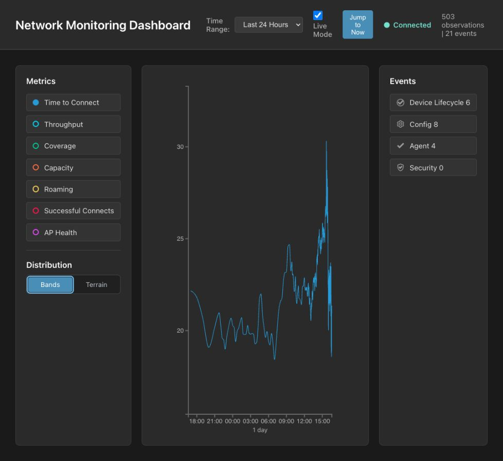
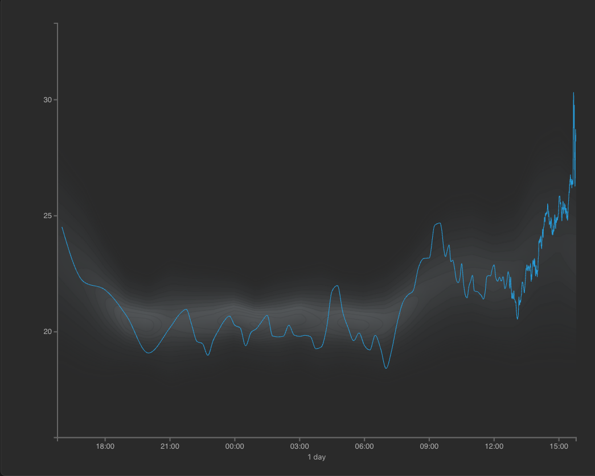
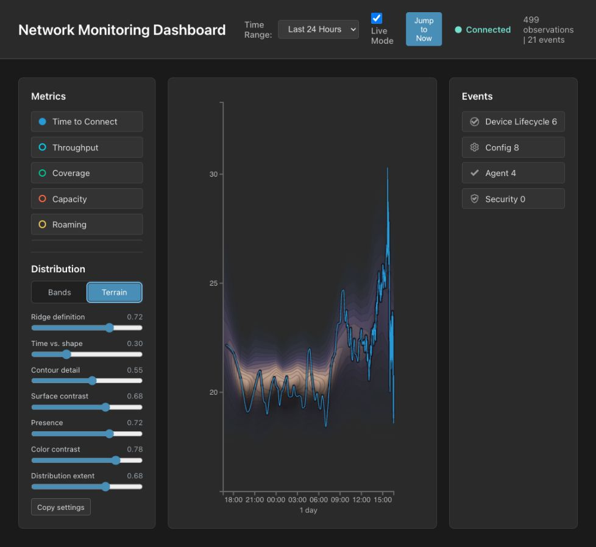
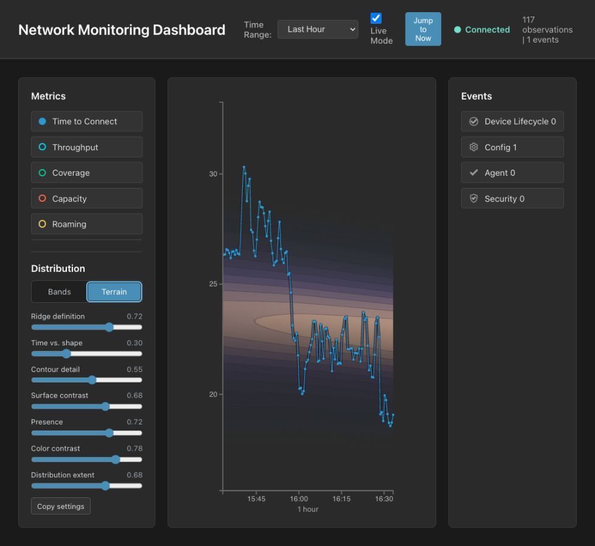
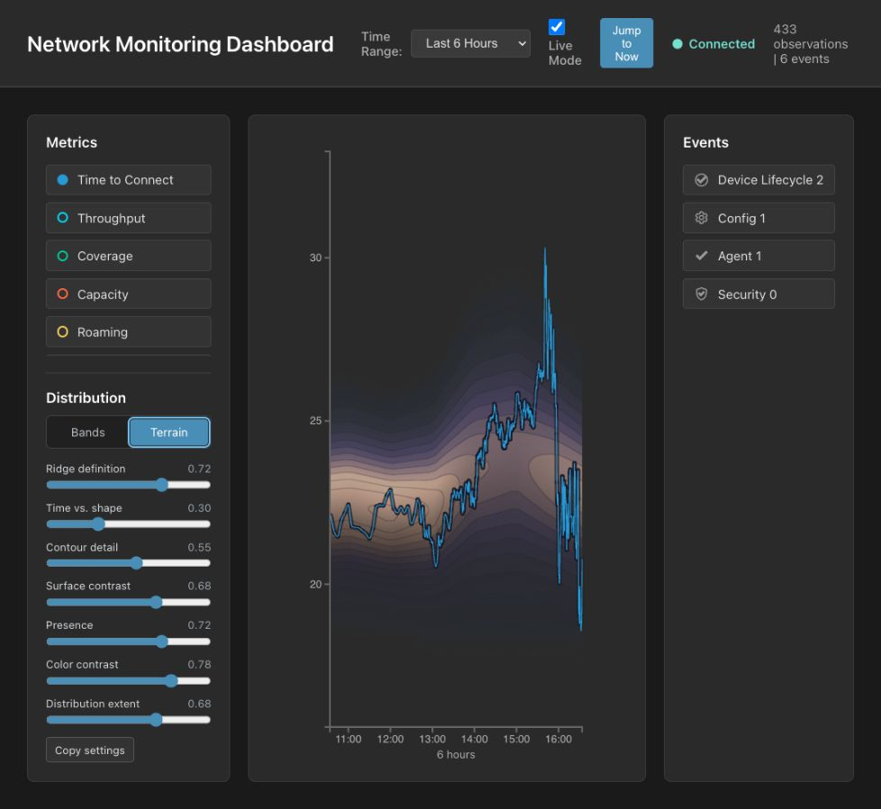
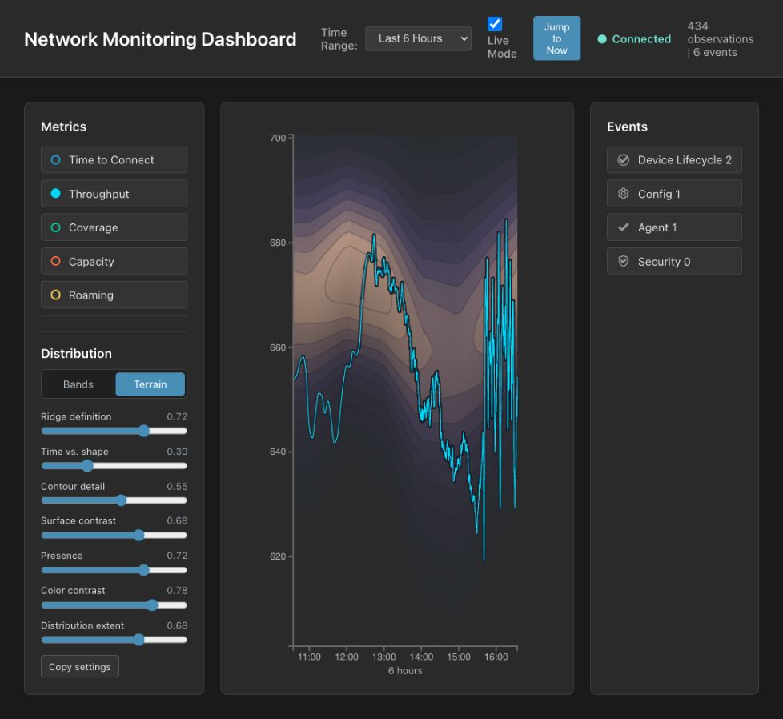
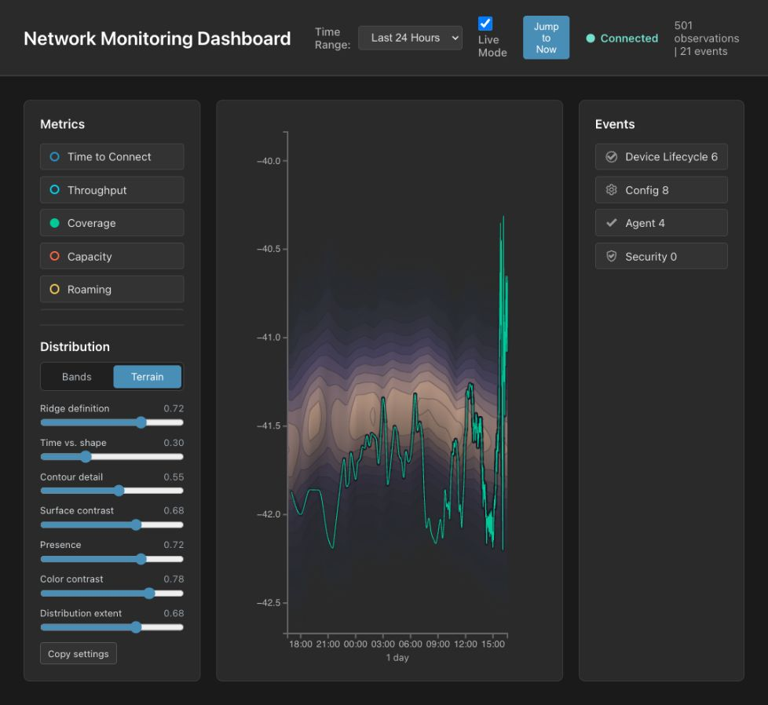

# Distribution Terrain Visual Acceptance

## Review scope

This review records the comparative acceptance pass for corrective implementation Steps 7–12. It uses actual simulator data and evaluates the visualization through the three original comprehension questions:

1. Is the measured value typical?
2. Where does the measured value become unusual?
3. Which periods are more predictable?

The review covers Time to Connect, Throughput, and Coverage over 1-hour, 6-hour, and 24-hour views. Automated tests separately cover style switching, multiple metrics, live updates, resize, Canvas/SVG alignment, interactions, settings, and deterministic raster behavior.

## Reference comparison

### Bands

[Open the current 24-hour Bands capture](../media/distribution-bands-current-24h.jpg)



Bands retains its previous explicit percentile zones and remains unchanged by the Terrain corrections.

### Initial Terrain

[Open the initial Terrain capture](../media/distribution-terrain-initial.png)



The initial implementation has low visual contrast, no decisive outer footprint, and no visual contact between the measured trace and terrain.

### Corrected Terrain — 24 hours

[Open the corrected 24-hour Terrain capture](../media/distribution-terrain-corrected-24h.jpg)



The corrected view makes the distribution footprint, slopes, and ridge visible before inspecting the trace. A follow-up implementation replaces the coincident dark trace treatment shown here with a soft shadow projected below the trace where historical density is meaningful.

## Range coverage

### Time to Connect — 1 hour

[Open the 1-hour capture](../media/distribution-terrain-corrected-1h.jpg)



The ridge is immediately distinguishable from the slopes. The trace begins above the terrain, crosses the outer boundary, passes through the ridge, and later leaves below it.

### Time to Connect — 6 hours

[Open the 6-hour capture](../media/distribution-terrain-corrected-6h.jpg)



The ridge's movement over time remains secondary to the trace-to-distribution relationship. The finite footprint clearly separates plausible historical values from empty chart space.

### Time to Connect — 24 hours

[Open the 24-hour capture](../media/distribution-terrain-corrected-24h.jpg)


The full-day view retains the ridge and outer boundary at a denser time scale. Typical overnight segments appear embedded, while large daytime departures visibly detach from the terrain.

## Metric coverage

### Throughput — 6 hours

[Open the Throughput capture](../media/distribution-terrain-corrected-throughput-6h.jpg)



The palette and contour logic remain effective at a very different metric scale. Broad and narrow terrain sections remain distinguishable, and the projected trace shadow follows the same density semantics.

### Coverage — 24 hours

[Open the Coverage capture](../media/distribution-terrain-corrected-coverage-24h.jpg)



The terrain remains readable over a small negative-value range. Trace segments below the expected ridge are visibly separated from the high-density region, demonstrating that the encoding is independent of metric units and direction.

## Comprehension findings

| Question | Acceptance result | Evidence |
| --- | --- | --- |
| Is the measured value typical? | Pass | The warm ridge and density-responsive shadow make trace proximity to the ridge visible in all three metrics. |
| Where does it become unusual? | Pass | The outer contour and fully transparent exterior create a decisive transition; the shadow disappears as the trace leaves support. |
| Which periods are more predictable? | Pass | Narrow periods form tighter, more densely contoured ridges; broader periods occupy visibly wider terrain. |
| Does color imply health? | Pass | The indigo–violet–warm-neutral sequence reads as elevation/density and contains no green/yellow/red status progression. |
| Is the measured series still primary? | Pass | The original core path remains unchanged and renders above the shadow and terrain layers. |

## Interaction and restoration findings

- Bands/Terrain switching preserves chart state and creates no duplicate layers.
- The terrain shadow is absent in Bands and multi-metric modes.
- Crosshair, tooltip, event, zoom, range, resize, and live-data tests pass with the new layers.
- Disabling and re-enabling a metric exposed a stale baseline-loaded flag. The flag is now invalidated when the metric is removed, and live browser verification confirms Terrain and the trace shadow return after re-enable.
- The dashboard was restored to Time to Connect, Terrain, and a connected state after acceptance checks.

## Performance finding

At a browser viewport producing an approximately 938 by 583 CSS-pixel terrain at device-pixel ratio 1.1, a full render measured 81.20 ms. This exceeds the 50 ms interaction target, so reduced-resolution preview rendering remains required during slider input.

The interaction path is active and covered at device-pixel ratio 2: a 920 CSS-pixel-wide plot uses a 920-pixel backing width during interaction and restores an 1840-pixel backing width on release. Keeping one raster pixel per CSS pixel preserves the terrain's contours, contrast, and apparent shape while settings change. Full device-resolution rendering remains the settled result after interaction.

## Acceptance decision

The corrective implementation passes the internal comparative acceptance gate. Relative to the initial Terrain implementation, it materially improves the ability to locate the distribution, identify its ridge, distinguish narrow and broad periods, and see where the measured trace enters or leaves historically typical values.

The committed defaults used in these captures are:

```json
{
  "ridgeDefinition": 0.72,
  "timeVsShapeBias": 0.3,
  "contourDetail": 0.55,
  "relief": 0.68,
  "presence": 0.72,
  "colorContrast": 0.78,
  "distributionExtent": 0.68
}
```
