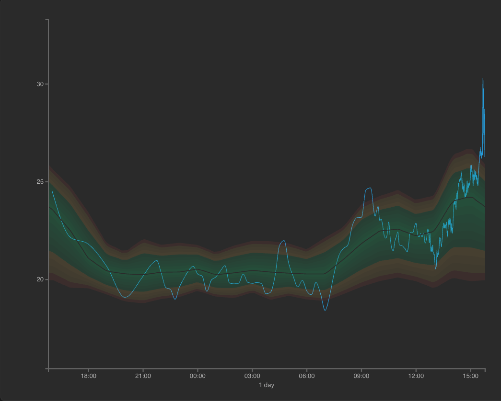
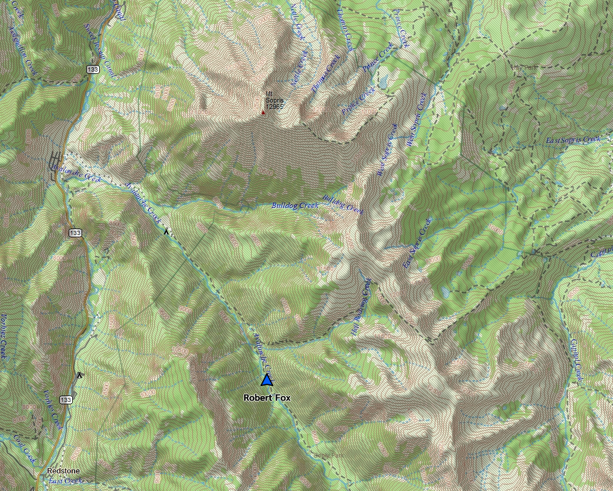

# Distribution Terrain Layer Implementation Plan

## Summary

Implement the behavior defined in [Distribution Terrain Layer Specification](./distribution-terrain-layer-spec.md) as a sequence of independently verified increments. Preserve the existing percentile bands, add a Canvas terrain renderer, and expose a Bands/Terrain selector with live terrain controls in the left rail.

Every step has a verification gate. Do not begin the next step until the current gate passes. Commit boundaries should follow these steps so each increment can be reviewed or reverted independently.

Steps 0–5 produced the initial working implementation. Step 6 exposed visual-comprehension shortcomings that keep the feature from meeting its intended outcome. The post-implementation findings and corrective Steps 7–12 below extend the plan. The feature is complete only after the revised final verification gate in Step 12 passes.

## Estimated impact

The implementation is expected to affect approximately 14–20 files in total:

- 6–8 new terrain implementation files
- 4–6 new or expanded test files
- 5–7 existing chart, app, style, and test-support files
- 2 documentation files, already established

Likely existing files touched during implementation:

- `frontend/src/chart/types.ts`
- `frontend/src/chart/ChartCore.ts`
- `frontend/src/chart/ChartView.ts`
- `frontend/src/main.ts`
- `frontend/index.html`
- `frontend/src/style.css`
- `frontend/src/tests/setup.ts`, if Canvas DOM methods require test mocks

The exact test-file grouping may change to follow the repository's existing conventions. Production responsibilities and step gates must remain as described below.

The corrective sequence in Steps 7–12 is expected to affect an additional 8–12 files, primarily within `frontend/src/chart/terrain/`, chart integration, terrain controls, tests, and visual-acceptance documentation. Each corrective step lists its own narrower impact estimate.

## Step 0 — Establish a clean baseline

### Outcome

Confirm that current behavior is healthy before terrain code is introduced.

### Expected file impact

- No product-file changes
- No planned test-file changes

### Work

- Run the complete frontend test suite.
- Run the production TypeScript/Vite build.
- Record current Bands behavior for one metric, multiple metrics, resizing, and live updates.
- Confirm the current distribution disappears in multi-metric mode and returns when one metric remains.

### Verification gate

Advance only when:

- `npm test` passes.
- `npm run build` passes.
- Existing Bands behavior has been observed in the browser without a terrain-related code change.

## Step 1 — Add terrain types, defaults, and baseline adaptation

### Outcome

Create the data and configuration foundation without rendering or UI changes. The app must continue to behave exactly as it does today.

### Expected file impact: 5–7 files

Likely additions:

- `frontend/src/chart/terrain/types.ts`
- `frontend/src/chart/terrain/defaults.ts`
- `frontend/src/chart/terrain/GaussianDensity.ts`
- `frontend/src/chart/terrain/baselineAdapter.ts`
- `frontend/src/tests/terrainData.test.ts`

Likely existing change:

- `frontend/src/chart/types.ts`

### Work

- Add `DistributionStyle`, `TerrainSettings`, density-model, Gaussian-parameter, and resolved-renderer configuration types.
- Add `DEFAULT_TERRAIN_SETTINGS` with the five source-controlled defaults and neutral palette constants.
- Implement Gaussian density and analytic value-gradient functions.
- Convert hourly baselines into timestamped `mu` and `sigma` descriptors.
- Implement the stddev, IQR, and Y-span sigma fallback sequence.
- Implement linear parameter interpolation and metric-level reference-sigma calculation.
- Add pure mappings from the five perceptual settings to raw renderer values.

### Required tests

- Gaussian density is symmetric around `mu` and peaks at `mu`.
- Smaller sigma produces a taller peak; larger sigma produces a broader density.
- Analytic gradients agree with numerical differencing within tolerance.
- Hourly parameter interpolation handles normal hours and midnight wraparound.
- Sigma fallback order is deterministic and always produces a finite positive value.
- Median reference sigma is independent of the visible observation count.
- Every slider value is clamped to `0–1` and maps deterministically to raw parameters.

### Verification gate

Advance only when:

- Targeted terrain-data tests pass.
- The complete existing frontend test suite passes.
- `npm run build` passes with strict TypeScript checks.
- The running app remains visually unchanged because no terrain renderer is mounted yet.

## Step 2 — Build and verify the pure raster renderer

### Outcome

Produce deterministic RGBA terrain buffers from distribution descriptors without touching the DOM or main chart.

### Expected file impact: 3–5 files

Likely additions:

- `frontend/src/chart/terrain/TerrainRasterizer.ts`
- `frontend/src/chart/terrain/color.ts`
- `frontend/src/tests/terrainRasterizer.test.ts`

Possible changes:

- Terrain types and defaults from Step 1

### Work

- Rasterize the density field into a caller-provided RGBA buffer.
- Calculate screen-space-normalized value and backward time gradients.
- Apply fixed contour bands, antialiased contour lines, ambient light, and directional hillshading.
- Keep contour intervals fixed across time for a metric.
- Apply the neutral slate palette and overall presence without health colors.
- Keep all calculations independent from Canvas, D3, and browser DOM APIs.

### Required tests

- Rendering the same inputs twice produces byte-identical output.
- Every output byte is finite and within `0–255`; no NaN or invalid density reaches the buffer.
- A constant distribution produces a calm horizontal ridge.
- A narrow distribution has a sharper profile and more contour crossings than a broad distribution under the same settings.
- The same field rendered under equivalent screen-space scales produces comparable shading.
- `presence: 0` produces a fully transparent buffer.
- Changing contour detail does not change density or hillshade calculations.
- Changing presence does not move contours or alter terrain structure.

### Verification gate

Advance only when:

- All rasterizer tests pass.
- Step 1 tests continue to pass.
- The complete frontend test suite passes.
- `npm run build` passes.
- A development assertion confirms a representative buffer contains both transparent background pixels and visible terrain pixels.

## Step 3 — Mount Terrain behind the SVG chart

### Outcome

Integrate the Canvas layer with the chart behind all measured-series and interaction elements. Terrain remains unreachable from the regular UI until Step 4.

### Expected file impact: 5–7 files

Likely addition:

- `frontend/src/chart/terrain/TerrainCanvasLayer.ts`
- `frontend/src/tests/terrainChartIntegration.test.ts`

Likely existing changes:

- `frontend/src/chart/ChartCore.ts`
- `frontend/src/chart/ChartView.ts`
- `frontend/src/style.css`
- `frontend/src/tests/setup.ts`, if Canvas mocks are needed

### Work

- Add a pointer-transparent Canvas aligned with the SVG plot bounds and positioned beneath the SVG.
- Size the backing buffer at device-pixel resolution, capped at device-pixel ratio 2.
- Add ChartView methods to select distribution style, apply terrain settings, and read current settings.
- Feed the terrain layer the selected metric's existing hourly baseline.
- Redraw on baseline, X/Y scale, range, resize, and setting changes.
- Hide Terrain when baseline data is unavailable or multiple metrics are active.
- Retain the selected style and session settings while Terrain is temporarily hidden.
- Coalesce repeated render requests with `requestAnimationFrame`.

### Required tests

- Canvas is created once, has `pointer-events: none`, and is removed during chart destruction.
- Canvas dimensions and plot offsets follow chart margins, resize, and device-pixel ratio.
- Terrain renders behind the SVG line and interaction layers.
- Programmatically selecting Terrain does not reload or mutate observations.
- Terrain hides in multi-metric mode and returns when one metric remains.
- Missing or invalid baseline data hides Terrain safely.
- Existing line, crosshair, tooltip, event-marker, zoom, and resize tests continue to pass.

### Verification gate

Advance only when:

- Terrain can be enabled programmatically in a browser and aligns with the measured line across the full plot.
- Crosshair, tooltip, event, zoom, pan, resize, and live-update interactions still work.
- All targeted integration tests pass.
- The complete frontend test suite and production build pass.
- Bands remains visually unchanged when Terrain is inactive.

## Step 4 — Add the Bands/Terrain selector

### Outcome

Make the new renderer user-selectable while retaining Bands as the initial experience.

### Expected file impact: 4–6 files

Likely existing changes:

- `frontend/index.html`
- `frontend/src/main.ts`
- `frontend/src/style.css`
- `frontend/src/chart/ChartView.ts`

Likely test change or addition:

- `frontend/src/tests/terrainControls.test.ts`

### Work

- Add a Distribution section beneath the metric controls in the left rail.
- Add a Bands/Terrain segmented selector with Bands selected initially.
- Switch renderers immediately without fetching data or changing chart state.
- Hide the Distribution section when the active metric count is not exactly one.
- Preserve the selected style when the section temporarily disappears.

### Required tests

- Bands is selected on startup.
- Selecting Terrain shows the Canvas and hides the SVG bands.
- Selecting Bands hides the Canvas and restores the existing bands.
- Switching styles preserves observations, active metric, time range, Y domain, live mode, and events.
- Distribution controls hide in multi-metric mode and return with their previous selection.
- Selector keyboard focus and activation work with native controls.

### Verification gate

Advance only when:

- The selector works against actual simulator data in the running app.
- Ten repeated Bands/Terrain switches produce no duplicate Canvas or SVG layers.
- Single-to-multi-to-single metric transitions restore the correct style.
- All targeted controls tests, the complete frontend suite, and the production build pass.

## Step 5 — Add live sliders and Copy settings

### Outcome

Allow the terrain to be tuned directly against actual network data and make the chosen values easy to transfer into source control.

### Expected file impact: 4–6 files

Likely addition:

- `frontend/src/chart/terrain/TerrainControls.ts`

Likely existing changes:

- `frontend/src/main.ts`
- `frontend/src/style.css`
- `frontend/index.html`
- `frontend/src/tests/terrainControls.test.ts`

### Work

- Show five sliders only when Terrain is selected for exactly one metric.
- Label sliders Ridge definition, Time vs. shape, Contour detail, Relief, and Presence.
- Display each current value to two decimal places.
- Apply changes to the actual chart during slider input and coalesce redraws through `requestAnimationFrame`.
- Add Copy settings to copy formatted JSON matching `DEFAULT_TERRAIN_SETTINGS`.
- Show brief copied or failure feedback.
- Keep settings in memory only; reload restores the source-controlled defaults.

### Required tests

- Controls initialize from `DEFAULT_TERRAIN_SETTINGS`.
- Each slider updates only its corresponding setting and displayed value.
- ChartView receives coalesced settings updates during repeated slider input.
- Copy settings emits valid JSON with exactly the five expected keys and current values.
- Clipboard failure produces visible feedback without changing settings.
- Sliders retain session values through metric and style changes.
- Reload behavior remains source-driven; no local storage is written.

### Verification gate

Advance only when:

- All five sliders visibly update Terrain against simulator data.
- Slider dragging remains responsive and the measured line remains readable at every default setting.
- Copied JSON can replace the object in `frontend/src/chart/terrain/defaults.ts` and pass the TypeScript build without editing its structure.
- Targeted control tests, the complete frontend suite, and the production build pass.

## Step 6 — Visual acceptance and performance hardening

### Outcome

Verify that the integrated visualization answers the intended questions and performs smoothly in the real app.

### Expected file impact: 0–4 files

No changes are required if all acceptance and performance checks pass. Potential changes are limited to terrain defaults, renderer internals, styles, or browser-test coverage.

### Work

- Inspect representative metrics over 1-hour, 6-hour, and 24-hour ranges.
- Evaluate whether the measured line reads as typical near the ridge and unusual on its outer slopes.
- Compare periods and metrics with narrower and broader baseline variance.
- Exercise live updates, zooming, panning, resizing, crosshair, tooltips, events, metric changes, and style changes.
- Measure full redraw time at representative chart sizes and device-pixel ratios.
- Tune only through the five settings first; change raw renderer constants only when slider ranges cannot reach an acceptable result.

### Required browser checks

- Bands remains visually identical to the baseline captured in Step 0.
- Terrain uses neutral colors and suggests no health or severity meaning.
- The measured line remains the dominant foreground element.
- Narrow periods appear sharper and more densely contoured than broad periods.
- Expected-ridge movement remains visible without dominating distribution shape.
- No stale pixels, seams, clipping errors, duplicate layers, or line/terrain misalignment appear during interaction.
- Crosshair, tooltip, event, and zoom interactions remain fully usable.

### Performance gate

- Measure a 1000 by 500 CSS-pixel plot at device-pixel ratio 2.
- If slider redraw p95 is at or below 50 ms, retain full-resolution rendering.
- If slider redraw p95 exceeds 50 ms, add reduced-resolution previews during active dragging and a full-resolution redraw on release, then repeat the measurement.
- Do not introduce ring-buffer rendering during this step.

### Initial implementation verification gate

Complete the initial implementation only when:

- All acceptance criteria in the specification pass in the browser.
- The complete frontend test suite passes.
- The production build passes.
- Performance meets the rule above.
- Copied settings match the committed source defaults selected during tuning.
- `git diff --check` reports no whitespace errors.

## Post-implementation findings — 7 July 2026

### Status of the initial implementation

- Steps 0–5 passed their functional and automated verification gates.
- The renderer, selector, live controls, copy-settings workflow, Canvas/SVG layering, and interaction behavior are working.
- The initial renderer passed deterministic raster tests, chart integration tests, the complete frontend suite, and the production build.
- Step 6 did not pass the visual-comprehension gate. Terrain is functional, yet it does not materially outperform Bands for understanding the relationship between the measured value and its expected distribution.

### Subjective review method

The review compared three captures at the same general viewing scale:

1. The app's existing Bands view. [Open full-size image](./media/distribution-bands-initial.png)

   

2. The app's initial Terrain view. [Open full-size image](./media/distribution-terrain-initial.png)

   

3. A conventional topographic map using contour lines, hillshading, and hypsometric color. [Open full-size image](./media/topographic-map-reference.png)

   

The app views were judged against the original questions without introducing statistical terminology:

- Is the measured value typical?
- Where does it become unusual?
- Which periods are more predictable?

### Findings

1. **Terrain has insufficient visual range.** The default terrain presence of `0.45` resolves to approximately `0.315` layer opacity. Both palette endpoints are desaturated slate colors, and the default palette-strength mapping cannot create meaningful hue or saturation separation. Terrain consequently reads as faint gray texture.
2. **The current controls cannot reach the desired result.** Ridge definition, lighting bias, contour detail, relief, and presence affect structure, lighting, or opacity. None directly controls color contrast, saturation, or the practical edge of the distribution.
3. **The terrain has no decisive footprint.** The Gaussian field fades gradually into the chart background. There is no clearly visible transition between a low-probability slope and the region where probability is effectively zero. Bands communicates this boundary more clearly.
4. **The ridge is not sufficiently distinct from its slopes.** Hillshading and contour lines are present, but the peak-density region lacks a strong color or luminance cue. The viewer must search for the expected-value ridge.
5. **The measured trace appears to float above the terrain.** The trace is a uniform bright SVG line composited above a separate Canvas. Its treatment does not respond to the density beneath it, so typical and unusual segments have the same visual relationship to the surface.
6. **Bands currently has greater visual presence.** Its saturated zones and explicit outer extent make the distribution easier to locate, even though the green/yellow/red palette risks implying health or severity.
7. **Color remains appropriate when it encodes density rather than health.** The initial prohibition on meaningful color variation was too restrictive. A perceptually ordered, non-traffic-light palette can distinguish empty space, low-density slopes, and the high-density ridge without claiming that typical values are healthy.
8. **The topographic metaphor has a useful limit.** Time and measured value define the map position; probability density defines elevation. A measured trace should cross contours when its typicality changes. A soft, displaced shadow can connect the trace to the terrain while preserving the chart's two-dimensional reading.
9. **A coincident under-stroke reads as a second line.** Post-implementation review found that the density-responsive stroke directly beneath the measured trace created a heavy outline and weakened the trace. The treatment should be visibly displaced and softened so it reads as a projected shadow.

## Expected improved outcome

The corrected Terrain view should produce the following visible progression:

| Question | Initial terrain | Expected corrected terrain |
| --- | --- | --- |
| Where does the distribution exist? | The field fades ambiguously into the chart background. | A visible outer boundary separates practical distribution support from empty chart space. |
| Where is the usual value? | The ridge must be inferred from subtle gray shading. | A distinct high-density color/luminance treatment makes the ridge immediately visible. |
| Is the measured value typical? | The trace has the same floating treatment everywhere. | A soft shadow projects onto meaningful terrain density and disappears when the trace leaves the distribution. |
| Does this period normally vary a lot? | Width is technically present but visually weak. | Narrow ridges and broad hills differ clearly in width, contour spacing, and surface shape. |
| Does color imply health? | Terrain is neutral but weak; Bands uses traffic-light colors. | Terrain uses a saturated sequential density palette that avoids green/yellow/red status semantics. |

The intended result is a meaningful improvement in comprehension rather than greater resemblance to a decorative map. A viewer should be able to locate the distribution footprint, identify its ridge, and see the measured trace enter or leave it before consulting a tooltip or legend.

## Corrective implementation sequence

The following steps continue the same checkpoint discipline as Steps 0–6. Each passing step receives its own commit before the next step begins.

## Step 7 — Extend the visual-encoding and settings contract

### Outcome

Create explicit renderer controls for density color and distribution extent while keeping the current appearance available until the new rendering behavior is introduced in later steps.

### Expected file impact: 5–8 files

Likely existing changes:

- `frontend/src/chart/terrain/types.ts`
- `frontend/src/chart/terrain/defaults.ts`
- `frontend/src/chart/types.ts`
- `frontend/src/chart/terrain/TerrainControls.ts`
- `frontend/src/tests/terrainData.test.ts`
- `frontend/src/tests/terrainControls.test.ts`
- `docs/distribution-terrain-layer-spec.md`

### Work

- Add `colorContrast` and `distributionExtent` to `TerrainSettings`.
- Retain `presence` as overall layer opacity rather than using it as a substitute for color contrast.
- Treat the existing `relief` setting as surface contrast in user-facing copy; preserve the source key unless a migration is simpler and fully tested.
- Extend the terrain palette from low/high endpoints to at least low, middle, and ridge stops.
- Define a non-traffic-light sequential density palette. Empty space remains the chart background; low density, slope, and ridge colors increase perceptually in saturation and luminance.
- Map `distributionExtent` to a finite relative-density cutoff with conservative defaults that approximate a broad outer probability envelope.
- Update Copy settings and source defaults to include the complete settings shape.
- Amend the specification's palette requirement: color may encode density/elevation; it must not encode health, severity, success, or failure.

### Required tests

- New settings clamp to `0–1` and map deterministically to renderer values.
- Presence changes only overall opacity.
- Color contrast changes only palette separation.
- Distribution extent changes only the support cutoff.
- The palette contains no traffic-light red/yellow/green progression.
- Copy settings emits the revised exact settings shape.
- Existing saved in-memory settings receive deterministic defaults for new keys.

### Verification gate

Advance only when:

- Targeted settings and control tests pass.
- The complete frontend test suite and production build pass.
- Bands remains visually unchanged.
- Terrain still renders with the previous structure; Step 7 introduces no accidental geometric change.
- `git diff --check` passes.

## Step 8 — Give the terrain a finite footprint and visible outer boundary

### Outcome

Make the region of meaningful historical probability immediately distinguishable from empty chart background.

### Expected file impact: 3–6 files

Likely existing changes:

- `frontend/src/chart/terrain/TerrainRasterizer.ts`
- `frontend/src/chart/terrain/types.ts`
- `frontend/src/chart/terrain/defaults.ts`
- `frontend/src/tests/terrainRasterizer.test.ts`

Possible addition:

- `frontend/src/chart/terrain/supportBoundary.ts`

### Work

- Apply the configured relative-density cutoff before alpha composition.
- Produce fully transparent pixels outside the practical support envelope.
- Draw an antialiased outer contour at the cutoff so the terrain has a readable edge.
- Preserve fixed metric-level density reference behavior so narrow and broad periods remain comparable.
- Keep the cutoff stable during live updates, resize, and range changes.
- Ensure `distributionExtent` expands and contracts the envelope without moving the ridge or changing the underlying density.

### Required tests

- Pixels beyond the configured support cutoff are fully transparent.
- The boundary remains continuous for a constant Gaussian field.
- Increasing distribution extent expands the visible footprint monotonically.
- Changing extent does not change `mu`, `sigma`, density values, or ridge position.
- Narrow and broad distributions retain different widths under the same extent.
- Presence zero still produces a fully transparent buffer.

### Verification gate

Advance only when:

- A browser capture shows a clear terrain-to-background transition over 1-hour, 6-hour, and 24-hour ranges.
- The outer boundary has no seams at hourly interpolation points.
- No clipping or stale pixels appear during zoom, pan, live updates, or resize.
- Targeted tests, the complete frontend suite, and the production build pass.
- `git diff --check` passes.

## Step 9 — Add perceptually ordered color, stronger contours, and a distinct ridge

### Outcome

Make low-density slopes, the main terrain body, and the high-density ridge readable as different elevations at a glance.

### Expected file impact: 4–7 files

Likely existing changes:

- `frontend/src/chart/terrain/TerrainRasterizer.ts`
- `frontend/src/chart/terrain/defaults.ts`
- `frontend/src/chart/terrain/types.ts`
- `frontend/src/chart/terrain/TerrainControls.ts`
- `frontend/src/tests/terrainRasterizer.test.ts`
- `frontend/src/tests/terrainControls.test.ts`

Possible addition:

- `frontend/src/chart/terrain/color.ts`

### Work

- Replace the two-stop slate interpolation with a multi-stop sequential density ramp.
- Use both saturation and luminance to separate low-density slopes from the ridge.
- Increase the useful range of surface contrast and contour-line strength.
- Add a restrained ridge-crest treatment through the high-density palette stop or a narrow peak highlight.
- Keep colors independent from metric health and classifier status.
- Add a Color contrast slider that can move from subdued to strongly separated without changing terrain geometry.
- Relabel Relief as Surface contrast in the UI and widen its useful visual range.

### Required tests

- Representative outside, low-density, mid-slope, and ridge samples follow the intended alpha and perceptual ordering.
- Color contrast changes pixel color while leaving alpha, contours, density, and geometry unchanged.
- Surface contrast changes hillshade range while leaving support and palette stops unchanged.
- Contour detail retains fixed intervals across time.
- Deterministic raster snapshots or byte-level fixtures cover subdued, default, and high-contrast settings.
- Bands output remains unchanged.

### Verification gate

Advance only when:

- The ridge and outer boundary can each be located in an unlabelled screenshot without adjusting sliders.
- Narrow and broad periods are visibly distinguishable at the committed defaults.
- The terrain is clearly separate from the chart background while the measured trace remains readable.
- A review of the palette finds no plausible traffic-light health ordering.
- Targeted tests, the complete frontend suite, and the production build pass.
- `git diff --check` passes.

## Step 10 — Add a terrain-responsive trace shadow

### Outcome

Connect the measured trace to meaningful distribution density with a soft, displaced shadow that disappears when the trace leaves the terrain.

### Expected file impact: 5–8 files

Likely addition:

- `frontend/src/chart/terrain/terrainTraceShadow.ts`
- `frontend/src/tests/terrainTraceShadow.test.ts`

Likely existing changes:

- `frontend/src/chart/generators/LineGenerator.ts`
- `frontend/src/chart/ChartView.ts`
- `frontend/src/chart/terrain/baselineAdapter.ts`
- `frontend/src/chart/terrain/types.ts`
- `frontend/src/tests/terrainChartIntegration.test.ts`

### Work

- Keep the measured line's core color, position, and stroke width unchanged.
- Evaluate historical density at each measured observation using the same interpolated parameters and support cutoff as the terrain.
- Project a visibly displaced, blurred shadow below the core line only where density is meaningful.
- Close the shadow to zero at the ridge so the measured trace appears to touch the terrain tangent there. Open the shadow across either slope, then fade it smoothly to zero at the outer boundary.
- Remove the shadow outside the terrain footprint.
- Keep the treatment below the measured core line and above the terrain Canvas.
- Preserve event, crosshair, tooltip, marker, and multi-metric layering.
- Hide the shadow in Bands mode and whenever Terrain itself is unavailable.

### Required tests

- The measured core path is byte-for-byte or attribute-for-attribute unchanged by Terrain mode.
- Shadow strength is zero at the ridge and support boundary and reaches its maximum on the intervening slope.
- Shadow opacity is zero outside the support cutoff.
- The shadow follows the measured path through zoom, resize, range changes, and live append while retaining its projection offset.
- Bands and multi-metric modes contain no terrain-shadow layer.
- Crosshair dots and tooltips remain above all trace treatments.

### Verification gate

Advance only when:

- A trace segment exactly on the ridge has no shadow and appears to kiss the terrain tangent; the shadow becomes visible as the trace moves onto either slope.
- The same trace visibly loses its shadow as it crosses the outer terrain boundary.
- The shadow does not obscure small measured variations or suggest a second measured series.
- The trace remains the dominant foreground element.
- Targeted tests, the complete frontend suite, and the production build pass.
- `git diff --check` passes.

## Step 11 — Complete revised controls and source defaults

### Outcome

Expose the new visual variables for real-time tuning, select committed defaults from actual simulator data, and keep the configuration easy to transfer into source control.

### Expected file impact: 4–7 files

Likely existing changes:

- `frontend/src/chart/terrain/TerrainControls.ts`
- `frontend/src/chart/terrain/defaults.ts`
- `frontend/src/main.ts`
- `frontend/src/style.css`
- `frontend/src/tests/terrainControls.test.ts`
- `docs/distribution-terrain-layer-spec.md`

### Work

- Add Color contrast and Distribution extent controls.
- Present Relief as Surface contrast.
- Follow-up review replaces implementation-oriented labels with visual-design vocabulary: Ridge sharpness, Lighting: shape ↔ time, Contour density, Shading contrast, Terrain opacity, Color saturation, Visible extent, and Shadow crispness.
- Add Shadow crispness as one control over projected-shadow blur and spread while preserving its direction and offset.
- Keep all controls live against the actual chart.
- Preserve session-only behavior and source-controlled defaults.
- Keep Copy settings synchronized with the revised settings object.
- Tune defaults using at least three metrics and 1-hour, 6-hour, and 24-hour ranges.
- Verify defaults against both stable and changing baseline shapes rather than tuning for one screenshot.

### Required tests

- Every visible control updates exactly one setting.
- All displayed values match the settings passed to ChartView.
- Session retention, style switching, metric switching, and reload behavior remain correct.
- Copy settings round-trips into `DEFAULT_TERRAIN_SETTINGS` without structural edits.
- Rapid input remains coalesced and ends with a full-resolution render.

### Verification gate

Advance only when:

- Each control causes an immediate and understandable visual change.
- The committed defaults satisfy the Step 9 and Step 10 visual gates without slider adjustment.
- Slider extremes remain usable and never make the measured trace unreadable.
- Performance is measured against the existing 50 ms p95 rule. Slider interaction preserves the settled rendering resolution even when the target is exceeded, because a resolution change invalidates the visual comparison.
- Targeted tests, the complete frontend suite, and the production build pass.
- Copied settings exactly match the committed defaults.
- `git diff --check` passes.

## Step 12 — Comparative comprehension acceptance

### Outcome

Demonstrate that corrected Terrain provides a meaningful comprehension advantage over the initial Terrain implementation and a useful complement to Bands.

### Expected file impact: 1–5 files

Likely additions or changes:

- `docs/design-review/distribution-terrain-visual-acceptance.md`
- Before/after browser captures in `docs/design-review/`
- Terrain defaults, renderer constants, or tests only if a gate fails

### Work

- Capture Bands, initial Terrain, and corrected Terrain at matching metric, time range, Y domain, and viewport settings.
- Repeat the comparison for at least three metrics and the 1-hour, 6-hour, and 24-hour ranges.
- Include examples of a trace near the ridge, crossing a slope, and outside the support boundary.
- Record direct answers to the three comprehension questions for each example.
- Ask reviewers to interpret the captures before showing statistical labels or implementation details.
- Record whether the palette is perceived as density/elevation, health/severity, or an ambiguous decoration.
- Re-run interaction and performance checks from Step 6.

### Subjective acceptance gate

Advance only when reviewers can consistently:

- Locate the terrain footprint and ridge at first inspection.
- Identify whether a selected trace segment is near the ridge, on a slope, or outside the distribution.
- Identify which of two periods has the narrower expected distribution.
- Point to where the trace becomes unusual without relying on a tooltip or statistical explanation.
- Describe the color progression as amount, density, or elevation rather than health or severity.
- Distinguish the measured trace from its projected shadow.

Record disagreements and failed examples as findings. A failed comprehension item requires another focused rendering/defaults checkpoint before final completion.

### Automated and performance gate

- All 1-hour, 6-hour, and 24-hour captures are free of seams, clipping, stale pixels, or Canvas/SVG misalignment.
- Bands remains visually unchanged from the Step 0 baseline.
- Crosshair, tooltip, events, zoom, pan, resize, live append, metric switching, and style switching remain usable.
- A 1000 by 500 CSS-pixel plot at device-pixel ratio 2 is measured against the 50 ms p95 redraw rule and retains identical rendering resolution throughout slider interaction.
- The complete frontend test suite passes.
- The production build passes.
- `git diff --check` passes.

### Revised final verification gate

Complete the feature only when:

- Steps 7–11 have separate passing checkpoint commits.
- The comparative evidence and findings are recorded in the repository.
- The subjective acceptance gate passes on representative simulator data.
- The automated, interaction, build, and performance gates pass.
- Copied settings exactly match the committed source defaults.
- The corrected Terrain view materially improves the ability to answer the three original comprehension questions.

## Terrain-phase delivery boundaries

These boundaries applied to the Terrain implementation through Step 12. The final experiment conclusion and corrective Bands sequence below supersede the “no backend changes” boundary because calibrated baseline semantics are now a prerequisite for evaluating either visualization.

- No backend or API changes are required.
- No health encoding, prediction, additional density models, persisted settings, user-facing explanatory UI, synthetic scenario UI, or ring buffer is included.
- Saturated color is permitted only as a density/elevation channel. Metric health and severity remain outside this terrain layer.
- Existing unrelated workspace changes must remain untouched.

## Final experiment conclusion

The Terrain experiment does not pass the Step 12 subjective acceptance gate. The corrective work made the distribution more visible and visually distinctive, but it did not materially improve how quickly a viewer could answer the three original questions compared with Bands:

1. Is the measured value typical?
2. Where does it become unusual?
3. Which period is more predictable?

The limiting issue is the metaphor itself. A topographic map describes one physical surface shared by contours, paths, and shadows. In this chart, probability density is represented as an imagined height while the measured series remains an independent time-series overlay. Stronger color, contours, and a projected trace shadow improved the illusion, but they also added relationships that required interpretation. The repeated need to tune ridge, lighting, relief, extent, and shadow treatments is evidence that the representation is visually sensitive without becoming more direct.

Bands retains the stronger comprehension model because it expresses containment directly: a value is near the center, between reference boundaries, or outside the expected envelope. Distribution width also remains immediately visible without requiring the viewer to infer simulated height.

The experiment still identified three topographic ideas worth carrying forward:

- Use a continuous visual progression rather than categorical health-colored regions.
- Give the distribution a clear outer footprint.
- Use explicit contour lines as stable percentile landmarks.

The recommendation is therefore to stop advancing Terrain as the product visualization and evolve Bands into a **contoured distribution ribbon**. Terrain may remain temporarily available only as an implementation comparison until the revised Bands treatment passes acceptance.

## Recommended contoured distribution ribbon

The revised Bands treatment should use the selected metric's existing hue for the distribution, the measured trace, and the contour family. Color communicates metric identity only; it does not communicate health or severity.

The visual contract is:

- Derive a perceptually normalized palette from the selected metric color so blue, cyan, green, orange, yellow, and red metrics have comparable visual weight on the dark chart background.
- Keep the measured trace as the most saturated and crisp use of the metric hue.
- Make the center of the distribution slightly less saturated than the measured trace while giving it enough opacity and luminance contrast to be immediately visible.
- Fade saturation and opacity continuously away from p50 using the actual percentile anchors rather than linearly interpolating only between p5, p50, and p95.
- Extend the faint distribution footprint to p1 and p99. Under a calibrated baseline, values outside this footprint should represent approximately 2% of comparable observations rather than the 10% implied by the current p5–p95 edge.
- Draw five obvious contour lines at p5, p25, p50, p75, and p95. These correspond to percentile whiskers, quartiles, and median for this app's box-plot convention.
- Make p50 the strongest contour, p25/p75 the next strongest pair, and p5/p95 clear outer-whisker landmarks. The p1/p99 footprint should fade beyond the outer contour pair rather than adding two more dominant lines.
- Keep the measured trace above all ribbon and contour layers with a small neutral separation treatment only if needed for contrast. Do not use a density-responsive under-stroke or projected shadow.
- Preserve asymmetry: skewed percentile spacing should produce visibly asymmetric gradients and contours.

### Expected improved outcome

| Question | Current Bands | Recommended ribbon |
| --- | --- | --- |
| What metric am I looking at? | Distribution colors imply health zones and differ from the trace. | Ribbon, contours, and trace share the selected metric hue. |
| Where is the usual value? | The p50 line is present, but competes with categorical color regions. | The most concentrated fill and strongest contour meet at p50. |
| How far is the value from usual? | The viewer crosses discrete green/yellow/red regions. | A continuous same-hue fade shows distance, while five contours provide exact landmarks. |
| Where does the expected distribution end? | The colored region stops at p5/p95, so approximately 10% outside is normal. | The visible footprint fades to p1/p99; p5/p95 remain explicit whisker contours. |
| Does color imply health? | Yes, plausibly. | No; hue identifies the selected metric and intensity identifies concentration. |
| Does normal variability change over time? | Band width communicates it. | Contour spacing and gradient width preserve and strengthen that reading. |

## Corrective Bands implementation sequence

Each step uses the same checkpoint rule as the Terrain work: complete its tests and verification gate, then create a commit before beginning the next step.

## Step 13 — Calibrate baseline and live-data semantics

### Outcome

Ensure the historical baseline and the measured trace represent comparable samples before judging any distribution visualization. Define percentile expectations explicitly so visual outliers have a trustworthy meaning.

### Why this is required

The current ribbon spans p5–p95, which predicts approximately 10% of comparable observations outside the ribbon even in a correctly calibrated system. The current simulator diverges much further: a diagnostic sample from the running 12-hour view placed approximately 39–58% of representative metric observations outside p5–p95 and 24–45% outside p1–p99.

The live-generation sequence is inconsistent with bootstrap generation. Bootstrap calls `generate_all_metrics_at` once per AP and timestamp. The live loop iterates metrics first and calls `generate_observation` once per metric and AP. Because classifier state is shared, it advances while producing the first metric and is then reused for subsequent metrics. At a sampled live timestamp, all six APs had identical Throughput and Coverage values while Time to Connect varied across APs. This makes the clean baseline and measured series different stochastic products.

### Expected file impact: 4–8 files

Likely existing changes:

- `backend/main.py`
- `backend/simulator/realistic_generator.py`
- `backend/simulator/bootstrap.py`
- Backend simulator and bootstrap tests
- Optional diagnostic script or fixture under `backend/tests/`

### Work

- Generate all metrics once per AP and timestamp in both bootstrap and live paths.
- Capture classifier breakdowns without advancing shared state again for each metric.
- Make AP aggregation semantics identical between baseline computation, stored observations, HTTP responses, and WebSocket observations.
- Separate clean operating variation from explicitly injected perturbations in calibration reports.
- Define expected outside rates for clean data: approximately 10% outside p5–p95 and 2% outside p1–p99, allowing statistically justified tolerance and accounting for temporal correlation.
- Add a deterministic diagnostic that reports outside rates per metric and hour for clean simulation and for perturbation-inclusive simulation.
- Decide the intended perturbation frequency separately from baseline calibration. Perturbations may legitimately create clustered excursions, but their frequency should match the product story rather than compensate for a generator mismatch.

### Required tests

- Bootstrap and live generation use the same state-advance function and produce the same output shape for a fixed seed and timestamp sequence.
- Every metric at a timestamp is derived from the intended state snapshot rather than from metric-loop order.
- Reordering metric names does not change generated values.
- AP aggregation is consistent across stored, HTTP, and WebSocket representations.
- A long deterministic clean run falls within defined tolerance around the expected p5–p95 and p1–p99 outside rates.
- Enabling perturbations increases or clusters outside observations without changing the clean baseline.

### Verification gate

Advance only when:

- The clean measured series and baseline are statistically calibrated for every displayed metric.
- Large excursions can be attributed to an explicit perturbation or to the stated percentile probability, rather than generation-order mismatch.
- The current 12-hour view no longer shows systematic displacement of whole metrics from their hourly baseline.
- Backend tests pass and a fresh bootstrap-to-live transition is continuous.
- `git diff --check` passes.

## Step 14 — Replace health-colored regions with a metric-hue gradient

### Outcome

Render one continuous, same-hue distribution field from p1 through p99, centered visually at p50, while preserving the existing measured trace.

### Expected file impact: 5–9 files

Likely existing changes:

- `frontend/src/chart/generators/DistributionRibbonGenerator.ts`
- `frontend/src/chart/ChartView.ts`
- `frontend/src/chart/types.ts`
- `frontend/src/style.css`
- Distribution renderer and chart-integration tests
- `docs/distribution-terrain-layer-spec.md` or a successor ribbon specification

### Work

- Remove `STATUS_ZONE_COLORS` from ribbon rendering.
- Derive ribbon colors from the selected metric's trace color using perceptually consistent lightness and saturation limits.
- Keep the p50 fill slightly less saturated than the measured trace.
- Fade both opacity and saturation toward p1 and p99, reaching full transparency at the footprint boundary.
- Interpolate through p1, p5, p25, p50, p75, p95, and p99 so skew and unequal percentile spacing remain visible.
- Keep the gradient continuous across percentile anchors with no color or opacity reset.
- Preserve metric switching, range changes, resize, live append, and multi-metric behavior.

### Required tests

- Every metric produces a ribbon derived from its configured trace hue.
- The p50 fill is less saturated than the measured trace and more visually concentrated than tail samples.
- Alpha reaches zero at p1 and p99 and remains zero outside them.
- No traffic-light status colors are used by the ribbon renderer.
- Asymmetric percentile fixtures produce asymmetric ribbon geometry.
- The measured trace path and color remain unchanged.

### Verification gate

Advance only when:

- The distribution and trace clearly belong to the same metric-color family.
- The trace remains the strongest foreground mark.
- The p50 region is immediately locatable without a legend.
- The p1/p99 footprint is visible as a deliberate fade rather than an ambiguous chart-background stain.
- Blue, cyan, green, orange, yellow, and red metric examples have comparable perceived weight.
- Targeted tests, the complete frontend suite, the production build, and `git diff --check` pass.

## Step 15 — Add five percentile contour lines

### Outcome

Add stable landmarks at p5, p25, p50, p75, and p95 without recreating categorical colored bands.

### Expected file impact: 3–7 files

Likely existing changes:

- `frontend/src/chart/generators/DistributionRibbonGenerator.ts`
- `frontend/src/chart/ChartView.ts`
- `frontend/src/style.css`
- Distribution renderer and interaction tests

### Work

- Draw contour paths at p5, p25, p50, p75, and p95 from the same interpolated distribution points used by the fill.
- Use a clear hierarchy: strongest p50, medium p25/p75, quieter but obvious p5/p95.
- Derive contour color from the metric hue while maintaining contrast against both the ribbon and chart background.
- Keep contour width and opacity stable across time so distribution width is communicated by spacing rather than style changes.
- Ensure contours remain aligned through interpolation, resize, range changes, and live updates.
- Keep contours below the measured trace, event marks, crosshair, dots, and tooltip.

### Required tests

- Exactly five contour paths exist for a single active metric with a baseline.
- Each contour uses the correct percentile values and remains ordered for valid distributions.
- p50 has the strongest visual treatment; paired quartile and whisker lines share their respective treatments.
- Bands with missing or degenerate percentile data fail gracefully without crossed or invalid paths.
- Multi-metric mode and hidden-distribution mode contain no ribbon contours.
- Existing interaction tests continue to pass.

### Verification gate

Advance only when:

- A reviewer can identify center, quartile range, and outer whiskers without statistical instruction.
- Narrow and broad periods are immediately distinguishable from contour spacing.
- The lines read as landmarks within one continuous distribution, not as boundaries between health states.
- The measured trace remains visually dominant at crossings.
- Targeted tests, the complete frontend suite, the production build, and `git diff --check` pass.

## Step 16 — Comparative acceptance and Terrain retirement

### Outcome

Determine whether the contoured ribbon improves comprehension over current Bands and Terrain, then remove experimental Terrain UI and code only after the replacement passes.

### Expected file impact: 4–15 files

Likely additions or changes:

- `docs/design-review/distribution-ribbon-visual-acceptance.md`
- Matching screenshots under `docs/media/`
- `frontend/src/main.ts`
- `frontend/src/chart/ChartView.ts`
- Terrain controls, renderer, defaults, tests, and styles if retirement is approved

### Work

- Capture current Bands, final Terrain, and contoured ribbon at matching metric, range, Y domain, and viewport settings.
- Test at least three metric hues and the 1-hour, 6-hour, 12-hour, and 24-hour ranges.
- Include calibrated examples near p50, between p25/p75, between p5/p95, in the p1/p5 or p95/p99 tail, and outside p1/p99.
- Ask the original comprehension questions before explaining percentiles.
- Record whether viewers interpret hue as metric identity and intensity as concentration rather than health.
- Confirm that the visible frequency of values outside the p1/p99 footprint is consistent with the calibrated simulator and explicit perturbations.
- If the contoured ribbon passes, remove the Bands/Terrain selector, Terrain tuning controls, Canvas layer, trace-shadow treatment, and Terrain-specific configuration from the production path. Preserve experiment findings and screenshots in documentation.

### Required tests

- Current chart interactions remain correct with the contoured ribbon as the sole single-metric distribution treatment.
- No Terrain Canvas, Terrain controls, trace shadow, or stale style-selection state remains after retirement.
- Metric selection updates ribbon hue and contours correctly.
- Copy-settings behavior is removed with Terrain controls unless it serves another accepted purpose.
- Historical and live data remain calibrated after a fresh bootstrap and through continuous operation.

### Final verification gate

Complete the revision only when:

- Viewers answer the three original questions at least as accurately as with current Bands and with less explanation than Terrain required.
- The same-hue treatment is understood as metric identity and distribution concentration.
- The five contour lines improve landmark recognition without recreating categorical status zones.
- Outside-footprint observations are statistically credible and traceable to percentile semantics or explicit perturbations.
- Terrain is removed from the active product UI after the replacement is accepted.
- All backend and frontend tests pass, the production build passes, visual evidence is recorded, and `git diff --check` passes.
